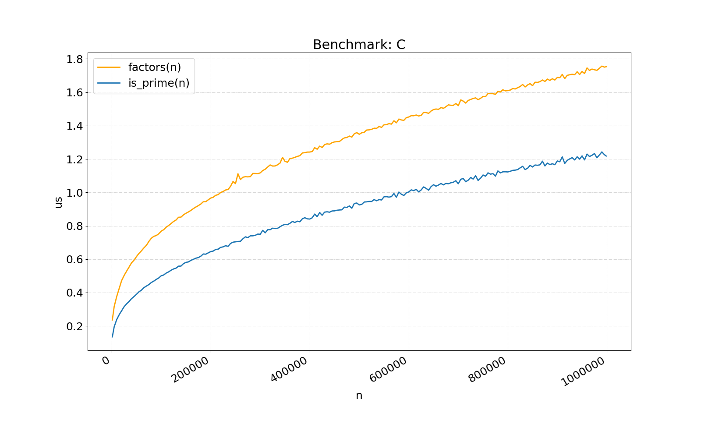
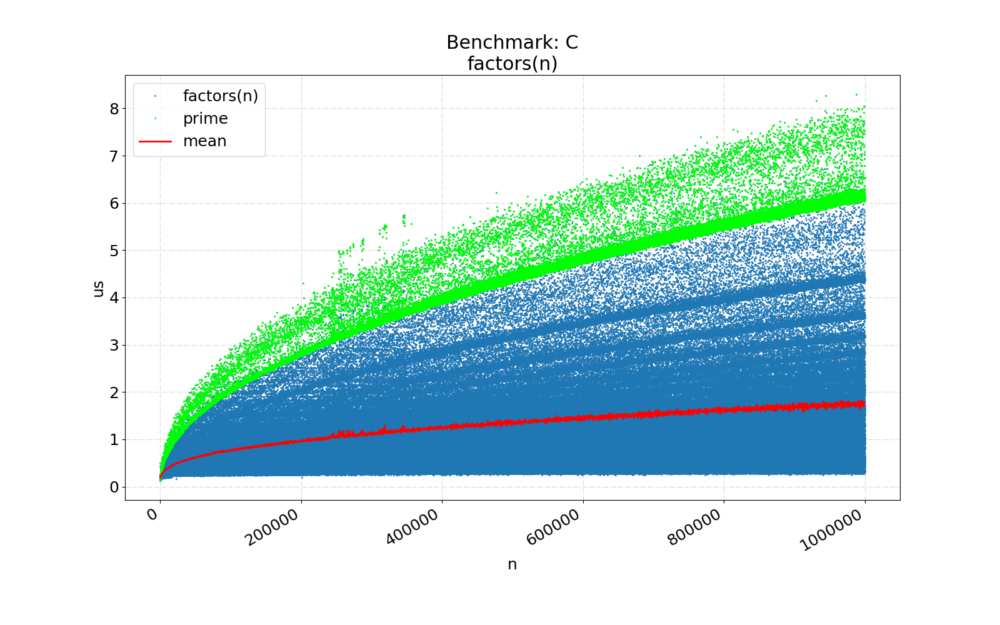

# wheel-factorization

Wheel factorization is an improvement of trial division method for
integer factorization. This project implements wheel factorization in
Python and C.

[Wikipedia Link](https://en.wikipedia.org/wiki/Wheel_factorization)

## Usage

#### Python

```python
from wheel_factorize import WheelFactor as WF
wf = WF(3)                  # basis size
print(wf.factors(10))
print(wf.factors(31))
print(wf.factors(9999991))
print(wf.factors(22222222222))
```

#### C

```C
#include "wheel_factorize.h"

struct wheel_factor wf;
wheel_factor_init(&wf, 3);  // basis size

long count;
long *primes = factors(&wf, 10, &count);            free(primes);
      primes = factors(&wf, 31, &count);            free(primes);
      primes = factors(&wf, 9999991, &count);       free(primes);
      primes = factors(&wf, 22222222222, &count);   free(primes);
```

#### Examples

```bash
$ make
$ ./examples/example 10 31 9999991 22222222222
$ PYTHONPATH="$PYTHONPATH:." python examples/example.py 1 10 31 9999991
```

## Performance

I was curious about the performance of these functions, so I measured
the time it took to calculate the factorization and primality from 1
to 1,000,000.



Some really interesting bands appeared in the scatter plot, that I think
are related to the number of factors. Notice the primes are highlighted in
green and take the longest to factorize. The number of factors probably
increase in each band from slowest to shortest execution (top to bottom).



## Takeaways
I learned a lot of cool math doing this simple project, namely the
[Sieve of Eratosthenes](https://en.wikipedia.org/wiki/Sieve_of_Eratosthenes),
an ancient algorithm for finding all the primes up to a given n.

I also learned that even though the Sieve of Eratosthenes is a great
algorithm for finding primes, it's not great at checking whether a given
n *is* prime. A modified version of the `factors` function is a *lot*
faster. In fact, there are many
[primality tests](https://en.wikipedia.org/wiki/Category:Primality_tests)
that may be interesting to explore.
